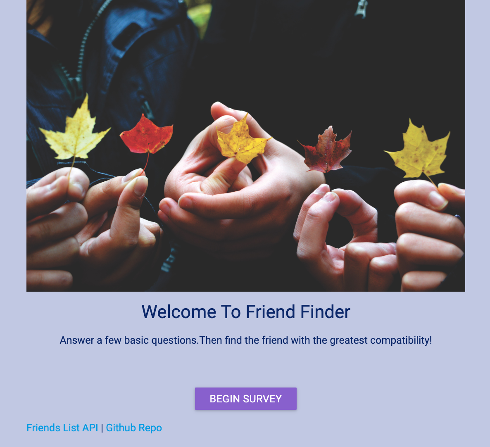

# FriendFinder

## Link
#### [Friend Finder](https://mysterious-citadel-42272.herokuapp.com) is deployed on heruku!  Please check it out and see who you match!

#### Description
Friend Finder implements friend matching based on the user's responses to a ten question survey. The user responds to questions by clicking on the  value slider from 1 (Strongly Disagree) to 5 (Strongly Agree). When the survey is submitted, an existing user record closest to the current user's responses is found and returned. The closest set of user responses is defined as the set with the lowest absolute difference for all ten questions combined.  Friend Finder application is meant to simulate a simple dating app. 

#### Technologies Used
* HTML
* Matelialize 
* jQuery
* Express
* Node
* JSON

When a user clicks the app, the following *landing*  page will appear.

Users will click on the slider for each question and submit their survey answers.  

 Then, the app will show them thier best match!  

### License
Copyright 2019 Wendy Alers | UCF Coding Boot Camp
